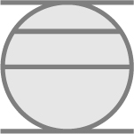

# Cryptodating.net

## Features to add

- [] 1/8inch standard bleed for easier printing.
- [] Option to arrange on letter-sized pre-perforated business card paper.
- [] Option to add a zero to even out puzzle, ie: when the puzzle looks best as a 3x3 block of symbols and this:

 

doesn't look as good as:

  

even though they both evaluate to 391, but I worry it would cause too much confusion.

## current bugs

- [] leading zeros a problem
- [] need to update key image to account for leading zeros, and possibly the 'aesthetic zeros' mentioned above.